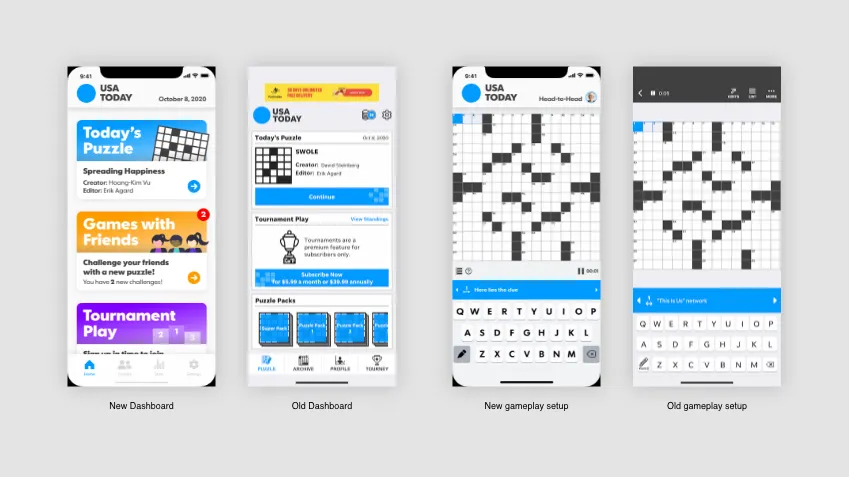
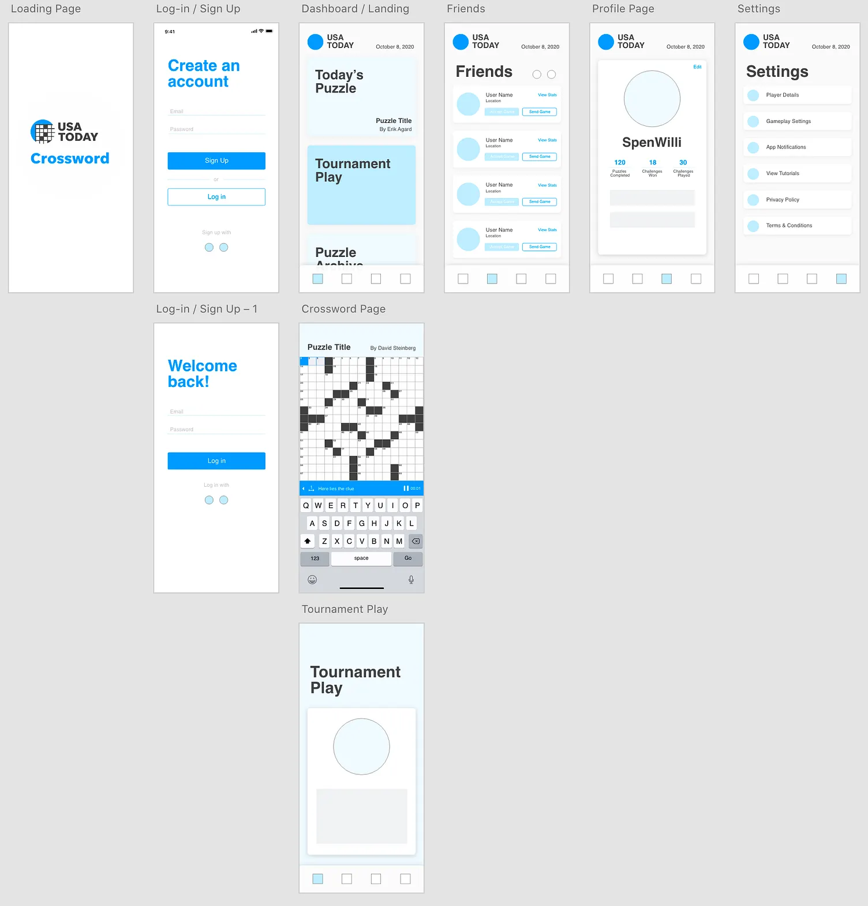

# Crossword Master - React Native

<div align="center">



**Una aplicación móvil completa de crucigramas construida con React Native y Expo**

[](https://reactnative.dev/)
[](https://expo.dev/)
[](https://www.typescriptlang.org/)
[](LICENSE)

[Características](#características) • [Instalación](#instalación) • [Arquitectura](#arquitectura) • [Desarrollo](#desarrollo) • [Licencia](#licencia)

</div>

---

## 📖 Descripción

**Crossword Master** es una aplicación móvil de crucigramas completamente funcional que ofrece una experiencia de juego inmersiva y entretenida. La aplicación funciona 100% offline, genera crucigramas dinámicamente y cuenta con un sistema completo de estadísticas y monetización.

### ✨ Características Principales

- 🎮 **Generación Dinámica de Crucigramas** - Algoritmo personalizado que genera crucigramas únicos
- 🎯 **4 Niveles de Dificultad** - Easy (9x9), Medium (11x11), Hard (13x13), Expert (15x15)
- 💡 **Sistema de Pistas Inteligente** - Obtén pistas viendo anuncios recompensados
- 📊 **Estadísticas Completas** - Seguimiento detallado por dificultad (partidas, tiempos, pistas)
- 💾 **Auto-guardado** - Tu progreso se guarda automáticamente
- 🌓 **Temas Claro/Oscuro** - Adapta la interfaz a tus preferencias
- 📱 **Retroalimentación Háptica** - Experiencia táctil mejorada
- 💰 **Monetización Integrada** - Google Mobile Ads (banner, intersticial, recompensado)
- 🔌 **100% Offline** - Juega sin conexión a internet

---

## 📸 Capturas de Pantalla

<div align="center">

| Inicio | Juego | Estadísticas | Configuración |
|:------:|:-----:|:------------:|:-------------:|
|  |  | _Coming soon_ | _Coming soon_ |

</div>

---

## 🚀 Instalación

### Prerrequisitos

- Node.js >= 18.x
- npm o yarn
- Expo CLI
- iOS Simulator (Mac) o Android Studio (para emuladores)

### Pasos de Instalación

```bash
# 1. Clonar el repositorio
git clone https://github.com/tu-usuario/crossword-app.git
cd crossword-app

# 2. Instalar dependencias
npm install

# 3. Iniciar el servidor de desarrollo
npx expo start

# 4. Ejecutar en iOS (requiere Mac)
npx expo run:ios

# 5. O ejecutar en Android
npx expo run:android
```

### Configuración de Anuncios

Para que los anuncios funcionen en producción, necesitas configurar tus IDs de AdMob:

1. Edita `app.json` y reemplaza los IDs de prueba:
```json
{
  "expo": {
    "plugins": [
      [
        "react-native-google-mobile-ads",
        {
          "androidAppId": "TU_ANDROID_ADMOB_APP_ID",
          "iosAppId": "TU_IOS_ADMOB_APP_ID"
        }
      ]
    ]
  }
}
```

2. Edita `src/services/adsManager.ts` y reemplaza los IDs de los anuncios.

---

## 🏗️ Arquitectura del Proyecto

### Estructura de Carpetas

```
crossword-app/
├── App.tsx                          # Punto de entrada principal
├── app.json                         # Configuración de Expo
├── package.json                     # Dependencias del proyecto
│
├── assets/                          # Recursos multimedia
│   ├── icon.png                     # Icono de la aplicación
│   ├── splash.png                   # Pantalla de inicio
│   ├── adaptive-icon.png            # Icono adaptativo Android
│   └── favicon.png                  # Favicon para web
│
├── src/                             # Código fuente
│   ├── components/                  # Componentes reutilizables
│   │   ├── BannerAdComponent.tsx    # Banner de publicidad
│   │   ├── CluePanel.tsx            # Panel de pistas con tabs
│   │   ├── CrosswordGrid.tsx        # Cuadrícula interactiva
│   │   ├── CustomKeyboard.tsx       # Teclado personalizado
│   │   ├── StatCard.tsx             # Tarjeta de estadística
│   │   └── TimerDisplay.tsx         # Temporizador del juego
│   │
│   ├── screens/                     # Pantallas de la aplicación
│   │   ├── HomeScreen.tsx           # Pantalla de inicio
│   │   ├── GameScreen.tsx           # Pantalla de juego principal
│   │   ├── StatsScreen.tsx          # Pantalla de estadísticas
│   │   ├── SettingsScreen.tsx       # Pantalla de configuración
│   │   └── TutorialScreen.tsx       # Tutorial de juego
│   │
│   ├── navigation/                  # Configuración de navegación
│   │   └── AppNavigator.tsx         # Navegador principal (Stack + Tabs)
│   │
│   ├── services/                    # Lógica de negocio
│   │   ├── adsManager.ts            # Gestión de anuncios (Google Ads)
│   │   ├── crosswordGenerator.ts    # Algoritmo de generación
│   │   └── storage.ts               # Persistencia (AsyncStorage)
│   │
│   ├── store/                       # Estado global
│   │   └── index.ts                 # Store de Zustand
│   │
│   ├── data/                        # Datos estáticos
│   │   └── wordDatabase.ts          # Base de datos de palabras (~90)
│   │
│   ├── constants/                   # Constantes y configuración
│   │   └── theme.ts                 # Sistema de diseño (colores, fuentes)
│   │
│   └── types/                       # Definiciones TypeScript
│       └── index.ts                 # Tipos principales
│
└── ios/                             # Configuración nativa iOS
```

### Patrón de Arquitectura

El proyecto sigue una **arquitectura basada en componentes** con clara separación de responsabilidades:

```
┌─────────────────────────────────────────────────┐
│                  SCREENS                        │
│  (HomeScreen, GameScreen, StatsScreen, etc.)    │
└────────────────┬────────────────────────────────┘
                 │
                 ▼
┌─────────────────────────────────────────────────┐
│               COMPONENTS                        │
│  (CrosswordGrid, CluePanel, CustomKeyboard)     │
└────────────────┬────────────────────────────────┘
                 │
                 ▼
┌─────────────────────────────────────────────────┐
│            STORE (Zustand)                      │
│  Estado Global: Game, Settings, Statistics      │
└────────────────┬────────────────────────────────┘
                 │
                 ▼
┌─────────────────────────────────────────────────┐
│               SERVICES                          │
│  (Generator, AdsManager, Storage)               │
└─────────────────────────────────────────────────┘
                 │
                 ▼
┌─────────────────────────────────────────────────┐
│          DATA & PERSISTENCE                     │
│  (WordDatabase, AsyncStorage)                   │
└─────────────────────────────────────────────────┘
```

---

## 🧩 Módulos Principales

### 📱 Screens (Pantallas)

| Screen | Descripción | Responsabilidades |
|--------|-------------|-------------------|
| **HomeScreen** | Pantalla de inicio | Selección de dificultad, acceso a tutorial, mostrar características |
| **GameScreen** | Pantalla de juego | Cuadrícula interactiva, temporizador, pistas, sistema de pausa |
| **StatsScreen** | Estadísticas | Mostrar estadísticas por dificultad, tiempos, pistas usadas |
| **SettingsScreen** | Configuración | Tema, sonido, hápticos, dificultad por defecto |
| **TutorialScreen** | Tutorial | Enseñar mecánicas del juego |

### 🧱 Components (Componentes)

| Component | Descripción | Props principales |
|-----------|-------------|-------------------|
| **CrosswordGrid** | Cuadrícula del crucigrama | `grid`, `selectedCell`, `onCellPress`, `theme` |
| **CluePanel** | Panel de pistas con tabs | `clues`, `selectedClue`, `onCluePress`, `theme` |
| **CustomKeyboard** | Teclado QWERTY | `onKeyPress`, `theme` |
| **TimerDisplay** | Temporizador | `elapsedTime`, `isPaused`, `theme` |
| **StatCard** | Tarjeta de estadística | `label`, `value`, `icon`, `theme` |
| **BannerAdComponent** | Banner publicitario | `position` ('top' / 'bottom') |

### ⚙️ Services (Servicios)

#### **crosswordGenerator.ts**
Algoritmo de generación de crucigramas:
- Genera cuadrículas de diferentes tamaños según dificultad
- Coloca palabras buscando intersecciones óptimas
- Numera celdas y genera pistas automáticamente

```typescript
generateCrossword(difficulty: DifficultyLevel): CrosswordData
```

#### **adsManager.ts**
Gestión de publicidad:
- Inicializa Google Mobile Ads SDK
- Gestiona anuncios intersticiales (tras completar)
- Gestiona anuncios recompensados (para pistas)
- Pre-carga anuncios para mejor UX

```typescript
initializeAds(): Promise<void>
showRewardedAd(onRewarded: () => void): Promise<void>
showInterstitialAd(): Promise<void>
```

#### **storage.ts**
Persistencia de datos:
- Guarda/carga configuración del usuario
- Guarda/carga estadísticas
- Guarda/carga estado del juego actual
- Limpieza de datos

```typescript
saveGameState(state: GameState): Promise<void>
loadGameState(): Promise<GameState | null>
saveSettings(settings: Settings): Promise<void>
loadSettings(): Promise<Settings | null>
```

### 🗄️ Store (Estado Global)

**Zustand Store** - Estado reactivo centralizado:

```typescript
interface StoreState {
  // Estado
  gameState: GameState | null
  currentCrossword: CrosswordData | null
  settings: Settings
  statistics: Statistics

  // Acciones de juego
  startNewGame: (difficulty: DifficultyLevel) => void
  updateCell: (row: number, col: number, letter: string) => void
  selectCell: (row: number, col: number) => void
  useHint: () => void
  pauseGame: () => void
  completeGame: () => void

  // Acciones de configuración
  updateSettings: (settings: Partial<Settings>) => void

  // Acciones de estadísticas
  updateStatistics: (difficulty: DifficultyLevel, time: number, hints: number) => void
  clearStatistics: () => void
}
```

---

## 🛠️ Stack Tecnológico

### Core
- **React** `19.1.0` - Biblioteca UI
- **React Native** `0.81.5` - Framework multiplataforma
- **Expo** `~54.0.23` - Plataforma de desarrollo
- **TypeScript** `~5.9.2` - Tipado estático

### Navegación
- **@react-navigation/native** `^7.1.19` - Navegación principal
- **@react-navigation/bottom-tabs** `^7.8.4` - Tabs inferiores
- **@react-navigation/native-stack** `^7.6.2` - Stack navigation

### Estado y Persistencia
- **zustand** `^4.4.7` - Gestión de estado global
- **@react-native-async-storage/async-storage** `^2.2.0` - Almacenamiento local

### Publicidad
- **react-native-google-mobile-ads** `^16.0.0` - Google Mobile Ads SDK

### UX
- **expo-haptics** `~15.0.7` - Retroalimentación háptica
- **expo-linear-gradient** `~15.0.7` - Gradientes
- **expo-status-bar** `~3.0.8` - Barra de estado

---

## 💻 Desarrollo

### Scripts Disponibles

```bash
# Iniciar servidor de desarrollo
npm start

# Ejecutar en iOS
npm run ios

# Ejecutar en Android
npm run android

# Ejecutar en web
npm run web

# Compilar para producción (iOS)
eas build --platform ios

# Compilar para producción (Android)
eas build --platform android
```

### Variables de Entorno

No se requieren variables de entorno para desarrollo. Para producción:

1. Configura tus IDs de AdMob en `app.json`
2. Reemplaza los IDs de prueba en `src/services/adsManager.ts`

### Modo Debug vs Producción

El código automáticamente detecta el modo:
```typescript
const adUnitId = __DEV__
  ? TestIds.REWARDED  // ID de prueba en desarrollo
  : 'ca-app-pub-XXXXX/XXXXX'; // Tu ID real en producción
```

---

## 🧪 Testing

### Pruebas Manuales

Checklist para testing:

- [ ] Generación de crucigramas en todas las dificultades
- [ ] Selección de celdas y entrada de texto
- [ ] Sistema de pistas (anuncios recompensados)
- [ ] Completar crucigrama y ver anuncio intersticial
- [ ] Guardado automático del progreso
- [ ] Estadísticas actualizándose correctamente
- [ ] Cambio de tema claro/oscuro
- [ ] Configuración persistiendo tras cerrar app
- [ ] Retroalimentación háptica funcionando

### Testing de Anuncios

Para probar anuncios en desarrollo:
- La app usa automáticamente IDs de prueba de Google
- Los anuncios de prueba siempre se cargan rápidamente
- No uses IDs reales en modo desarrollo

---

## 📊 Datos del Juego

### Base de Datos de Palabras

La app incluye ~90 palabras categorizadas por dificultad:

| Dificultad | Longitud | Cantidad Aprox. | Ejemplos |
|-----------|----------|-----------------|----------|
| **Easy** | 3-5 letras | ~25 | CAT, DOG, TREE, OCEAN |
| **Medium** | 5-7 letras | ~25 | FOREST, PLANET, GUITAR |
| **Hard** | 6-9 letras | ~20 | ELEPHANT, COMPUTER, BUTTERFLY |
| **Expert** | 7-11 letras | ~20 | ADVENTURE, ALGORITHM, ENCYCLOPEDIA |

### Tamaños de Cuadrícula

- **Easy**: 9x9 (8 palabras objetivo)
- **Medium**: 11x11 (12 palabras objetivo)
- **Hard**: 13x13 (16 palabras objetivo)
- **Expert**: 15x15 (20 palabras objetivo)

---

## 🎨 Sistema de Diseño

### Paleta de Colores

#### Light Theme
```typescript
primary: '#00A3E0'    // Azul principal
secondary: '#0077B6'  // Azul secundario
background: '#F5F7FA' // Fondo claro
surface: '#FFFFFF'    // Superficie blanca
text: '#1A1A1A'       // Texto oscuro
```

#### Dark Theme
```typescript
primary: '#00A3E0'    // Azul principal
secondary: '#0077B6'  // Azul secundario
background: '#121212' // Fondo oscuro
surface: '#1E1E1E'    // Superficie gris oscuro
text: '#FFFFFF'       // Texto blanco
```

### Tipografía

- **Extra Small**: 10px
- **Small**: 12px
- **Medium**: 14px
- **Large**: 16px
- **Extra Large**: 18px
- **2X Large**: 24px
- **3X Large**: 32px

### Espaciado

Sistema de espaciado consistente: `4px, 8px, 16px, 24px, 32px, 48px`

---

## 🚢 Deployment

### Compilar para iOS

```bash
# 1. Instalar dependencias iOS
cd ios && pod install && cd ..

# 2. Compilar con EAS
eas build --platform ios

# 3. O usar Xcode directamente
npx expo run:ios --configuration Release
```

### Compilar para Android

```bash
# 1. Compilar con EAS
eas build --platform android

# 2. O generar APK localmente
npx expo run:android --variant release
```

### Publicar con Expo

```bash
# Actualizar la app en Expo
eas update --auto

# Publicar en stores
eas submit --platform ios
eas submit --platform android
```

---

## 🤝 Contribuir

Las contribuciones son bienvenidas! Por favor:

1. Fork el proyecto
2. Crea una rama para tu feature (`git checkout -b feature/AmazingFeature`)
3. Commit tus cambios (`git commit -m 'Add some AmazingFeature'`)
4. Push a la rama (`git push origin feature/AmazingFeature`)
5. Abre un Pull Request

### Guías de Estilo

- Usa TypeScript para todo el código
- Sigue el patrón de arquitectura existente
- Documenta funciones complejas
- Mantén componentes pequeños y reutilizables
- Usa el sistema de diseño definido en `theme.ts`

---

## 📝 Roadmap

### Versión 1.1
- [ ] Más palabras en la base de datos (500+)
- [ ] Categorías temáticas (Deportes, Ciencia, Historia)
- [ ] Modo multijugador
- [ ] Logros y recompensas

### Versión 1.2
- [ ] Editor de crucigramas personalizado
- [ ] Compartir crucigramas con amigos
- [ ] Modo sin anuncios (compra única)
- [ ] Estadísticas avanzadas con gráficos

### Versión 2.0
- [ ] Backend con Firebase
- [ ] Crucigramas diarios
- [ ] Ranking global
- [ ] Sistema de usuarios

---

## 🐛 Problemas Conocidos

- Los anuncios pueden tardar en cargarse en redes lentas
- El teclado nativo a veces tarda en aparecer en Android
- Las estadísticas no se sincronizan entre dispositivos (sin backend)

---

## 📄 Licencia

Este proyecto está bajo la Licencia MIT. Ver el archivo [LICENSE](LICENSE) para más detalles.

---

## 👤 Autor

**Tu Nombre**

- GitHub: [@tu-usuario](https://github.com/tu-usuario)
- LinkedIn: [Tu Perfil](https://linkedin.com/in/tu-perfil)
- Email: tu-email@ejemplo.com

---

## 🙏 Agradecimientos

- [Expo](https://expo.dev/) - Por la increíble plataforma de desarrollo
- [React Navigation](https://reactnavigation.org/) - Sistema de navegación
- [Zustand](https://github.com/pmndrs/zustand) - Gestión de estado simple
- [Google Mobile Ads](https://admob.google.com/) - Monetización
- Comunidad de React Native

---

<div align="center">

**⭐ Si te gusta este proyecto, dale una estrella en GitHub! ⭐**

Hecho con ❤️ usando React Native y Expo

</div>
